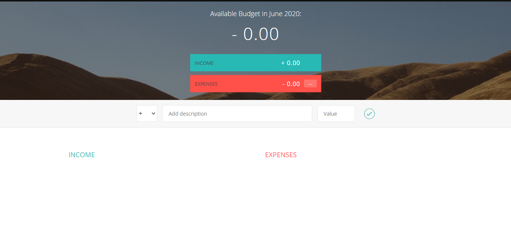
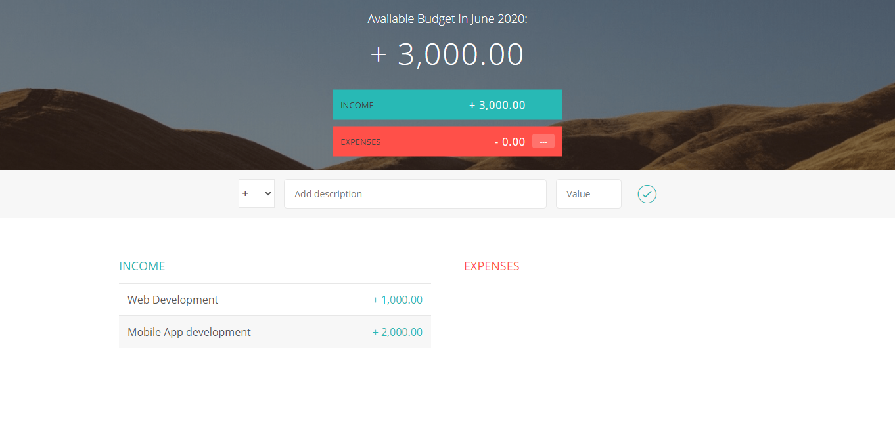
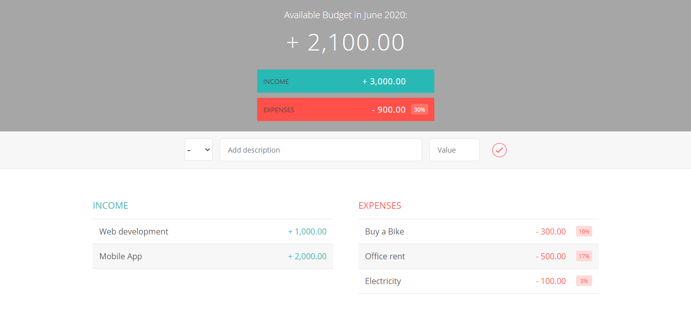
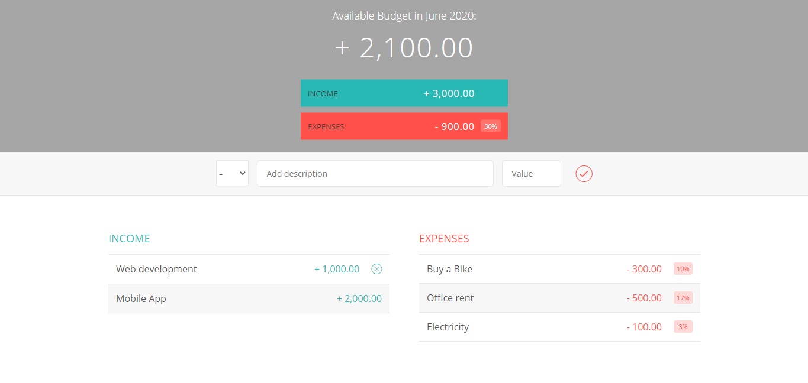
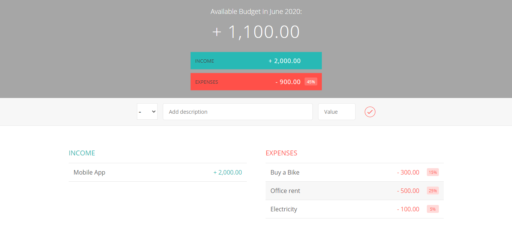

# Budget-App-Project

This is calculate your budget income and expenses.You can show easilly how much your income and how much you expenses with percentage in every expenses.Also you can
simply remove income or expenses

Image 1:(Initial Screen)

Image 2:(Add some income)

Image 3:(Add Some Expenses by selecting minus symbol)

Image 4:(If you want to remove any income or expenses then just hover the mouse on that then remove icon will be appear then click in that icon)

Image 5:(After removing)

